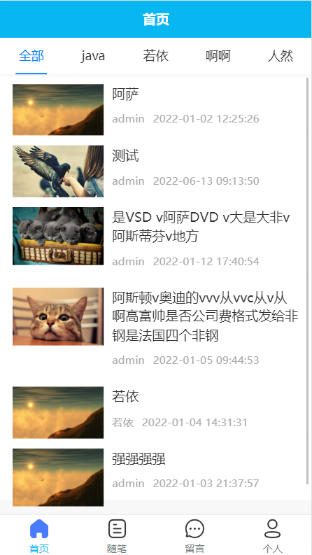
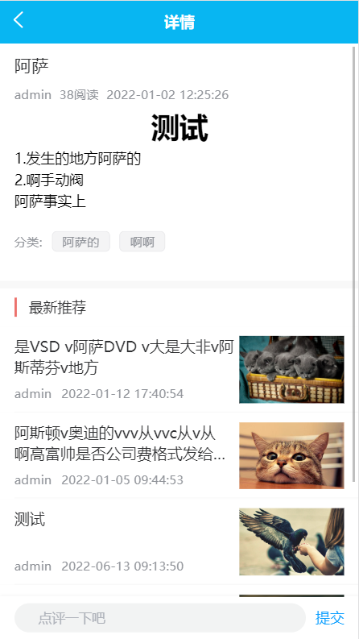
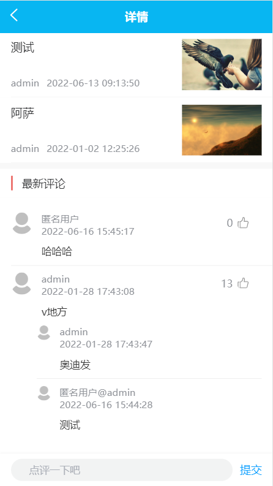
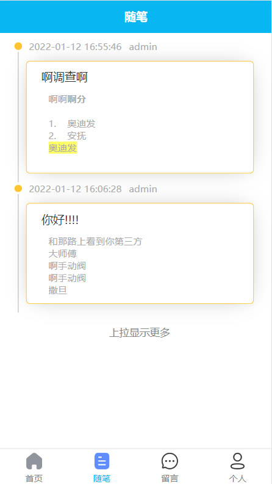
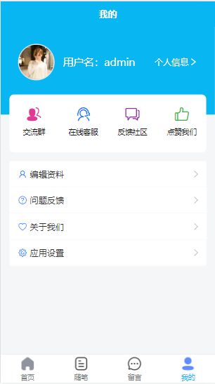
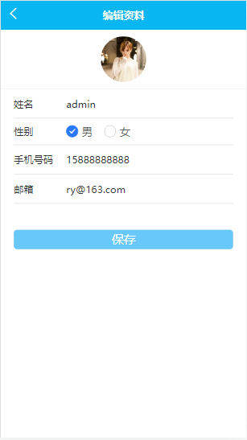
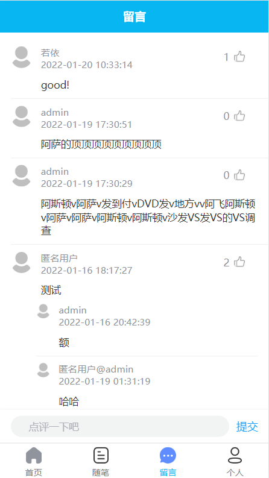
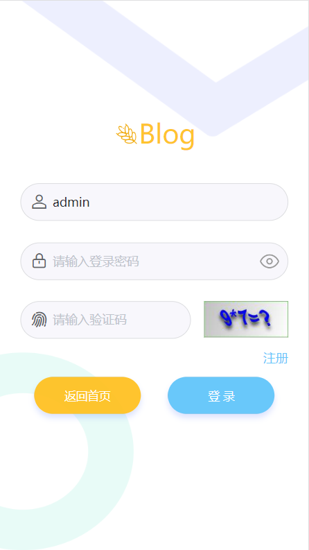

	

<h1 align="center" style="margin: 30px 0 30px; font-weight: bold;">Blog</h1>
<h4 align="center">RuoYi-Vue-Blog 博客网站uniapp版</h4>

<a target="_blank" href="https://www.cnblogs.com/Ning-Blog/">
</img>
</a>
<a target="_blank" href="https://gitee.com/Ning310975876/ruo-yi-vue-blog-uniapp/blob/master/LICENSE">
</img>
</a>

## 介绍

**RuoYi-Vue-Blog** 移动端 **博客网站**。

👍👍 感谢若依❤️❤️ 

基于 uniapp 开发，一份代码多终端适配，支持H5+支付宝小程序+微信小程序+APP

## 快速了解

**Blog** 后台、WEB端地址：<a href="https://gitee.com/Ning310975876/ruo-yi-vue-blog" target="blank">https://gitee.com/Ning310975876/ruo-yi-vue-blog</a>

#### uniapp知识

1. <a href="https://uniapp.dcloud.io/README" target="blank">uni-app介绍</a>
2. <a href="https://ke.qq.com/course/3169971" target="blank">uni-app 官方视频教程</a>
3. <a href="https://www.dcloud.io/hbuilderx.html" target="blank">uni-app开发工具 HBuilderX 下载及使用说明</a>
4. <a href="http://ask.dcloud.net.cn/article/35657" target="blank">uni-app是什么？能解决什么问题</a>

#### 技术手册

* <a href="https://uniapp.dcloud.io/collocation/pages" target="blank">uni-app 框架文档</a>
* <a href="https://uniapp.dcloud.io/component/README" target="blank">uni-app 组件文档</a>

## 如何使用Blog移动端

##### 一、导入uniapp项目

    1. 首先下载HBuilderX并安装，地址：https://www.dcloud.io/hbuilderx.html
    2. 打开HBuilderX -> 顶部菜单栏 -> 文件 -> 导入 -> 从本地目录导入 -> 选择移动端项目目录
    3. 找到config.js文件，找到里面的baseUrl项，填入已搭建的后端url地址

##### 二、本地调试

    1. 下载并启动ruo-yi-vue-blog后端程序
    2. 打开HBuilderX -> 顶部菜单栏 -> 运行 -> 运行到浏览器 -> Chrome

## 演示图

<table>
    <tr>
        <td></td>
        <td></td>
    </tr>
    <tr>
        <td></td>
        <td></td>
    </tr>
    <tr>
        <td></td>
        <td></td>
    </tr>
    <tr>
        <td></td>
        <td></td>
    </tr><tr>
		<td></td>
        <td></td>
    </tr>
    
</table>

## ToDo

- 下拉加载更多数据
- 评论点赞、回复
- 留言点赞、回复

 

